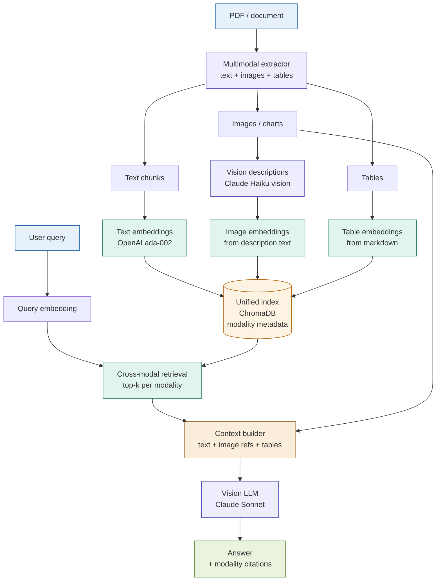

# 25: Multi-Modal RAG — Images, Tables, and Text

---

## The Problem

Standard RAG indexes text. Real financial documents are not just text.

An earnings release contains:
- A revenue trend bar chart (Q1–Q4 2024, $1.2B → $1.8B)
- A segment breakdown pie chart (Retail 42%, Institutional 38%, Trading 20%)
- A capital adequacy table (CET1: 13.2%, Tier 1: 14.8%, Total: 16.1%)
- Forty pages of prose

The text might say: *"Revenue performance was strong — see Figure 1."*

A text-only RAG system retrieves that sentence. It cannot retrieve Figure 1.
The answer to "What was the Q3 revenue?" exists only in the chart.
Without multimodal retrieval, the system either hallucinates or says "not found."

---

## The Concept

Extract each modality separately. Embed each modality into a shared vector space. Retrieve across all modalities. Synthesise with a vision LLM.

```
PDF / Document
      │
      ▼
[Multimodal extractor]
      │
  ┌───┴───────────────┐
  ▼                   ▼                   ▼
Text chunks        Images / charts      Tables
(prose)            (PNG/JPEG)           (markdown)
  │                   │                   │
  │            [Vision descriptor]        │
  │            Claude: "bar chart,        │
  │            Q1-Q4 revenue, axes,       │
  │            values, trend direction"   │
  │                   │                   │
  └───────────────────┼───────────────────┘
                      ▼
              [Text embeddings]  ← all modalities embedded as text
                      │
              [Unified index]    ← with modality metadata
                      │
                 User query
                      │
              [Cross-modal retrieval]
                      │
          ┌───────────┼───────────┐
          ▼           ▼           ▼
      Text          Image       Table
      passages    (base64)    (markdown)
          └───────────┼───────────┘
                      ▼
              [Vision LLM synthesis]
              Claude Sonnet: text + images together
                      │
                      ▼
             Answer + modality citations
```

---

## Architecture



---

## Key Insight

> **Some questions can only be answered from visual content.**

Every other RAG pattern in this workshop operates on text. This is the only pattern that operates on what text-based RAG discards.

The evidence for a query can live in three places:
- **Text** — "Revenue increased year-on-year." (vague)
- **Chart** — Bar chart showing $1.2B → $1.8B across four quarters. (precise)
- **Table** — Row: `Q3 2024 | $1.6B | +18% YoY`. (structured)

For a financial analyst, the chart and the table are the answer. The prose is the narrative wrapper around them. A RAG system that cannot reach the chart and the table is incomplete for financial document Q&A.

---

## Fintech Use Case: Earnings Report Chart Q&A

**Document**: Synthetic Q4 2024 earnings release — 3 charts, 2 tables, prose narrative.

**Query**: "What was the revenue trend across the four quarters, and which segment drove the Q4 increase?"

| Step | What happens | Modality |
|------|--------------|----------|
| 1 | Extract revenue trend bar chart (Q1–Q4), segment breakdown pie chart, prose narrative | Text + Image |
| 2 | Generate vision descriptions: "bar chart, quarterly revenue, Q1: $1.2B, Q2: $1.4B, Q3: $1.6B, Q4: $1.8B, upward trend" | Image → Text |
| 3 | Retrieve: top-2 text chunks + top-1 image (revenue chart) + top-1 table (segment breakdown) | Cross-modal |
| 4 | Synthesise with vision LLM — text blocks + image base64 in same API call | Vision LLM |
| 5 | Answer cites chart values directly: "Q4 revenue of $1.8B, up from $1.6B in Q3, driven by the Institutional segment (38% share, highest Q4 contribution)" | Grounded |

**Without multimodal RAG**: the system retrieves the prose sentence "revenue was strong — see Figure 1" and either hallucinates specific figures or returns an incomplete answer.

---

## Tradeoffs

| Dimension | Rating | Notes |
|-----------|--------|-------|
| Answer quality (visual queries) | ★★★★☆ | Uniquely answers questions whose evidence is in charts, tables, or figures |
| Answer quality (text queries) | ★★★☆☆ | No improvement over standard RAG; extraction overhead adds cost with no text-query benefit |
| Extraction complexity | ★★★★☆ | Native PDFs: good. Scanned PDFs: require OCR. Image quality affects vision description accuracy |
| Vision LLM cost | ★★☆☆☆ | Image description ~5–10× text embedding cost; large corpora are expensive to index |
| Complexity | ★★★★☆ | Three extraction pipelines + vision description + unified index + vision synthesis |

---

## When to Use Multi-Modal RAG

**Use it when**:
- Documents contain charts or figures where the answer lives in the visual, not the text
- Tables have structural content (row/column relationships) that prose extraction destroys
- The corpus contains scanned documents, dashboard screenshots, or image-only content
- Queries explicitly reference visual elements: "the chart shows...", "according to the table..."

**Avoid it when**:
- Documents are text-only — extraction overhead is pure cost
- Latency is a hard constraint — vision LLM calls are slower than text lookups
- The corpus is large and visual content changes frequently — re-indexing images is expensive
