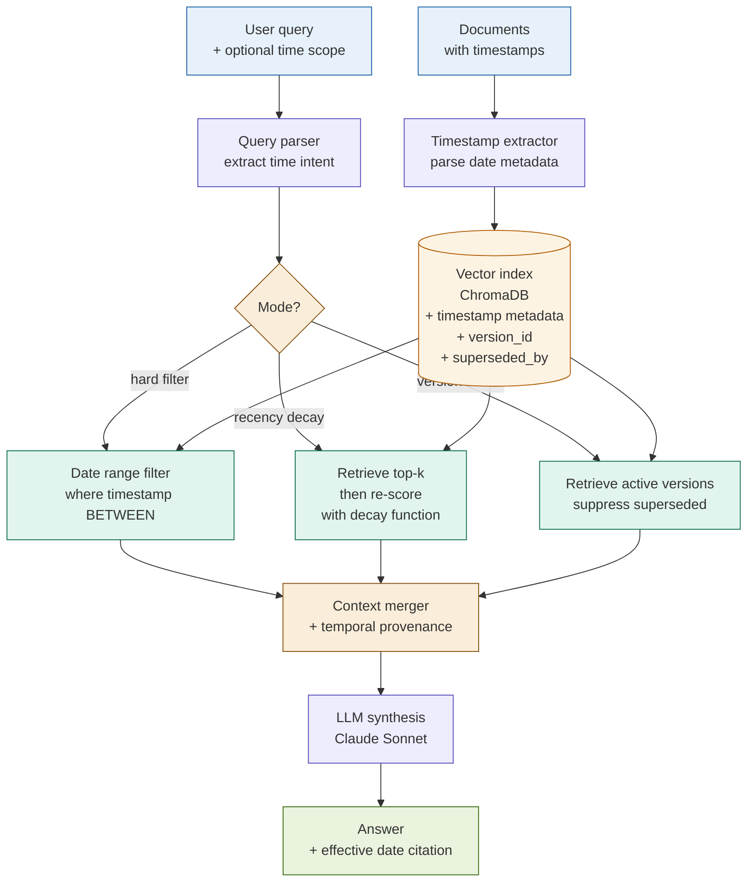

# Temporal RAG

## What it is

Temporal RAG attaches timestamps to indexed documents and applies time-aware scoring at retrieval time — through hard date filters, continuous time-decay weighting, or version-supersession logic — so that queries return information that was accurate at the right point in time. Standard RAG treats all indexed documents as equally current. It has no concept of when a document was written, when a regulation was amended, or when a policy was superseded. The consequence is silent staleness: a query about a capital adequacy threshold may retrieve a 2019 circular that was replaced by a 2023 update, with no signal that the returned answer is outdated.

Temporal RAG solves this by making the document's temporal position a first-class retrieval signal. Three mechanisms are supported depending on the use case: (1) **hard time filters** — exclude documents outside a date range entirely; (2) **time-decay scoring** — re-score retrieved documents so that recency contributes to the final ranking alongside semantic similarity; (3) **version-aware supersession** — when a document is explicitly superseded by a newer version, mark the old version as inactive and suppress it from retrieval unless a historical query explicitly targets the prior period.

The pattern was formalised by Dhingra et al. (TACL 2022) who demonstrated that language models encode temporal knowledge implicitly but unreliably — knowledge cutoff and document creation date both matter for factual accuracy, and explicit temporal signals at retrieval time significantly reduce stale-fact errors.

## Source

**"Time-Aware Language Models as Temporal Knowledge Bases"**
Bhuwan Dhingra, Jeremy R. Cole, Julian Martin Eisenschlos, Daniel Gillick, Jacob Eisenstein, William W. Cohen. TACL 2022.
arXiv:2106.15110. URL: https://arxiv.org/abs/2106.15110

## When to use it

- The corpus contains multiple versions of the same document over time (regulations, policies, internal guidelines) and queries should return the version current at a specified date.
- Regulatory or policy changes make older document versions actively misleading — a pre-amendment rule retrieved in response to a compliance query is worse than no answer.
- Queries are explicitly time-scoped: "What was the requirement before the 2023 update?", "What does the current policy say?", "How has this threshold changed over five years?"
- Market data, rate sheets, or pricing documents are indexed and go stale rapidly — results should be filtered to a relevant time window.
- **Fintech trigger**: regulatory change tracking (Basel III/IV amendments, MiFID II updates, Dodd-Frank rule revisions), lending policy versioning, interest rate history queries, audit trail reconstruction ("what did the policy say on date X?").

## When NOT to use it

- Documents have no reliable timestamps — applying time-decay to arbitrarily-dated documents degrades retrieval without any accuracy benefit.
- The entire corpus is effectively current (all documents created within the past month) — temporal weighting adds overhead with no differentiation.
- Recency is not a quality signal for the domain (e.g., a corpus of historical case studies where older documents are as relevant as newer ones).
- The corpus is small enough that a human reviewer can manually flag stale documents — temporal scoring infrastructure is overkill.

## Architecture

## Key components

| Component | Purpose | Default implementation |
|-----------|---------|----------------------|
| Timestamp extractor | Parse or infer a document's effective date from metadata, filename, header, or content | Extract from document metadata first; fall back to regex search for date patterns in the first 500 characters; last resort: file modification timestamp |
| Time-decay scorer | Re-score retrieved chunks so that recency contributes alongside semantic similarity | `decay_score = semantic_score * exp(-λ * days_since_doc)` where λ controls decay rate; λ=0.001 gives a half-life of ~693 days |
| Hard time filter | Exclude documents outside a caller-specified date range at retrieval time | ChromaDB `where` clause: `{"timestamp": {"$gte": start_ts, "$lte": end_ts}}` using Unix epoch integers |
| Version tracker | Maintain supersession relationships — when document B replaces document A, mark A as `superseded=true` with `superseded_by=B_id` | Dictionary of `{doc_id: {superseded: bool, superseded_by: str, superseded_on: date}}` stored as metadata |
| Version-aware retriever | Retrieve only the active (non-superseded) version of each document unless a historical query explicitly targets an earlier period | Filter on `superseded=false` for current queries; remove filter for historical queries |
| Temporal query parser | Detect whether the query implies a time scope (current, historical, before/after a date) | Keyword pattern matching for time signals ("current", "latest", "before 2022", "as of"); falls back to current-document mode |

## Step-by-step

1. **At index time: attach timestamp metadata to every chunk.** Parse the document's effective date from its header, metadata fields, or filename. Store as a Unix epoch integer (for range comparisons in ChromaDB `where` clauses) and as an ISO date string (for display). Also store `version_id`, `superseded` (boolean), and `superseded_by` (document ID or empty string).
2. **At index time: register supersession relationships.** When a new version of a document is indexed, update the previous version's metadata: set `superseded=true`, `superseded_by=<new_doc_id>`, `superseded_on=<date>`. This can be done as a metadata update without re-embedding — the vector does not change, only the retrieval eligibility.
3. **At query time: parse the query for temporal intent.** Classify the query as one of: `current` (retrieve latest active version), `historical` (retrieve version in effect at a specific date), `range` (retrieve documents within a date window), or `comparative` (retrieve multiple versions for before/after comparison). This classification determines which retrieval mode to invoke.
4. **Retrieve with the appropriate mode.** For `current`: apply `superseded=false` filter. For `historical`: apply `timestamp <= target_date` filter and sort by recency. For `range`: apply `timestamp BETWEEN start AND end` filter. For `comparative`: run two separate retrievals (before and after the change date) and merge.
5. **Apply time-decay re-scoring (for recency-weighted mode).** After retrieval, re-score each result: `final_score = semantic_score * exp(-λ * age_in_days)`. Sort by `final_score`. The λ parameter controls how aggressively recency is weighted — tune per corpus (high λ for rapidly-changing data, low λ for stable regulatory text).
6. **Synthesise with temporal provenance.** Include each chunk's effective date in the context. The system prompt instructs the LLM to cite the effective date alongside any factual claim: "As of [date], the requirement was X." This makes temporal grounding visible in the answer.

Steps 3–5 correspond to notebook cells 3–4.

## Fintech use cases

- **Regulatory change tracking (Basel III → Basel IV):** The Basel III framework was progressively amended from 2010 through the Basel IV finalisation in 2023. A corpus containing all amendment circulars, consultation papers, and final rules across that period can be queried for "the current CET1 requirement" (version-aware: returns the 2023 final rule), "the requirement before the 2023 revision" (historical: returns the pre-2023 circular), or "how the leverage ratio requirement changed between 2015 and 2023" (comparative: returns both versions with their effective dates).
- **Lending policy versioning and audit trail:** Internal lending policies are updated quarterly. A query about the maximum DTI ratio for a specific loan type should return the policy version in effect on the application date, not the current policy — because credit decisions are evaluated against the rules that applied when the decision was made. Temporal RAG enables point-in-time policy lookups for audit and dispute resolution.
- **Market data Q&A with time-bounded context:** Rate sheets, spread benchmarks, and pricing models change daily. Indexing multiple vintages with timestamps allows queries like "what was the prime rate context in our lending policy circular from Q2 2023?" — retrieving the rate sheet active during that period rather than today's figures.
- **MiFID II / Dodd-Frank regulatory evolution:** Regulatory text with amendment history allows compliance teams to reconstruct the rules applicable at any point in the past — essential for regulatory examinations, internal audits, and litigation support where the question is always "what was the rule at the time of the transaction?"

## Tradeoffs

| Dimension | Rating | Notes |
|-----------|--------|-------|
| Answer quality (time-sensitive queries) | ★★★★☆ | Prevents stale-data answers; enables point-in-time queries not possible with standard RAG |
| Recency signal | ★★★★★ | Explicit timestamp metadata is the most reliable recency signal available; far more robust than implicit model knowledge cutoffs |
| Metadata overhead | ★★★☆☆ | Timestamp extraction adds an indexing step; supersession tracking requires a maintenance workflow |
| Query latency | ★★★★☆ | Hard filters reduce the candidate set before scoring, often improving latency; decay re-scoring adds a linear post-processing step |
| Complexity | ★★☆☆☆ | The lowest-complexity addition to any RAG pipeline — timestamps are metadata, not a new retrieval architecture |

## Common pitfalls

- **Timestamps are often absent or unreliable.** Real-world document corpora frequently lack structured date metadata. PDFs may have a creation date that reflects when they were converted, not when the content was effective. Web-scraped documents may have crawl dates rather than publication dates. Build a timestamp extraction hierarchy: metadata fields first, then header text parsing, then filename date patterns, then human-curation for critical documents. Never silently fall back to the current date — that makes stale documents appear current.
- **Hard time filters silently exclude valid older documents.** A regulation that was enacted in 2010 and has never been amended is still current, but a `timestamp >= 2022` filter excludes it. Design filters as "effective at date X" (include all documents whose period covers X) rather than "created after date X." For regulations and policies with open-ended effective periods, store `effective_from` and `effective_until` (null = still active) and filter on `effective_from <= target_date AND (effective_until IS NULL OR effective_until >= target_date)`.
- **Recency bias degrades answers for stable knowledge domains.** With a high λ value, a 2024 document that barely mentions a concept will outscore a 2018 foundational document that covers it comprehensively. Tune λ per document type: high decay rate for market data and pricing (daily relevance), low decay rate for legal text and regulatory frameworks (multi-year relevance). A single λ for a mixed corpus is almost always wrong.
- **Supersession chains can break.** If document C supersedes B which superseded A, and B's metadata is corrupted or never updated, queries for the current version may return B rather than C. Validate supersession chains at index time: traverse the chain from the oldest document forward and assert that exactly one document per lineage has `superseded=false`.
- **Comparative queries require two distinct retrieval calls.** A query asking "how did X change between 2020 and 2023?" cannot be answered by a single time-filtered retrieval — it needs a before-retrieval and an after-retrieval. Detecting comparative intent in the query parser and routing to a dual-retrieval path is non-trivial but essential for this query type.
- **The LLM's own knowledge cutoff interacts with temporal RAG.** If the LLM was trained before a regulatory change, it may assert the old rule even when the retrieved context contains the new rule. The synthesis prompt must explicitly instruct the LLM to use retrieved context over parametric knowledge, and must require date citations so that contradictions between model knowledge and retrieved documents are visible.

## Related patterns

- **17 Corrective RAG** — CRAG detects when retrieved documents are irrelevant or contradictory and triggers corrective retrieval. Temporal RAG is a natural complement: when CRAG's relevance check detects that the retrieved document is outdated (the timestamp is old relative to the query's implied time scope), it can trigger a re-retrieval with a recency filter applied. Combining both patterns gives a pipeline that is self-correcting on both relevance and currency.
- **21 Modular RAG** — Modular RAG assembles retrieval pipelines from interchangeable components. The temporal filtering and decay-scoring components of Temporal RAG are natural modules in a Modular RAG pipeline — they can be inserted as post-retrieval scoring steps or pre-retrieval filter steps depending on the query type. A Modular RAG pipeline can route time-sensitive queries to the temporal path and stable-knowledge queries to the standard path.
- **20 Adaptive RAG** — Adaptive RAG classifies queries before routing them to the most appropriate retrieval strategy. Query classification for temporal intent (is this a "current" or "historical" query?) is a natural extension of Adaptive RAG's routing logic. An adaptive pipeline can route "regulatory change" queries to the temporal retriever and "product explanation" queries to the standard retriever without the caller needing to specify the retrieval mode.
