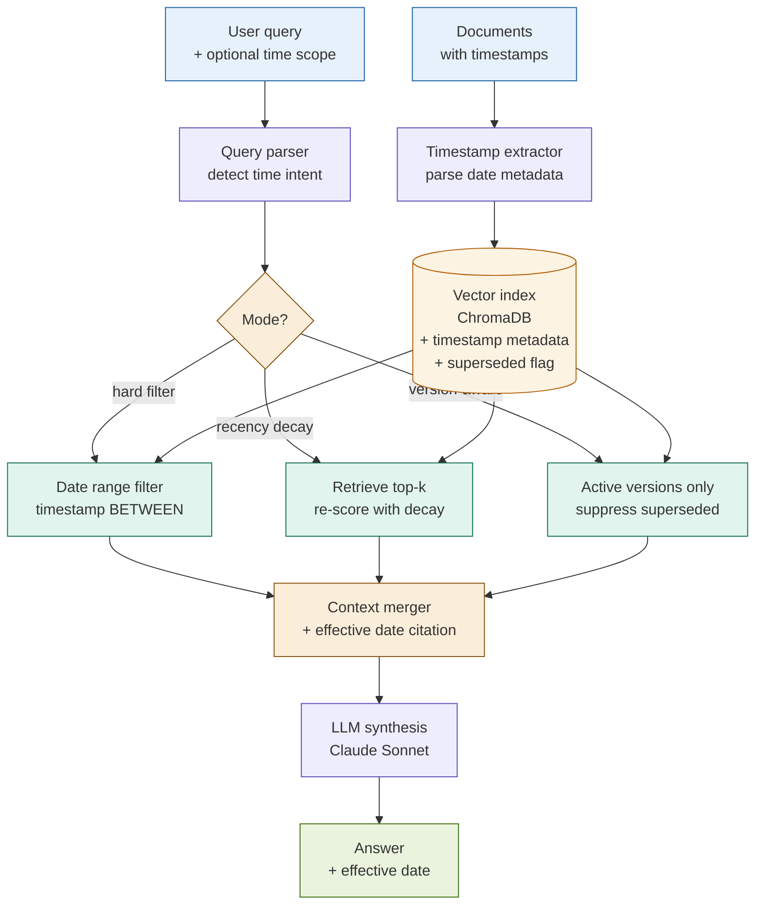

# 26: Temporal RAG — Time-Aware Retrieval

---

## The Problem

Standard RAG treats all indexed documents as equally current.

It has no concept of:
- When a document was written
- Whether it has been superseded
- Whether the answer it contains was accurate at the time of the query

**Example**: A corpus contains:
- Basel III circular, 2013: "Minimum CET1 ratio: 3.5%"
- Basel III amendment, 2019: "Minimum CET1 ratio: 4.5%"
- Basel IV final rule, 2023: "Minimum CET1 ratio: 4.5% (fully phased in)"

A query for "the current CET1 requirement" retrieves all three documents by semantic similarity. The 2013 circular scores well — it's highly relevant. The answer it contains is wrong.

Standard RAG returns stale data with no warning. The system doesn't know it's wrong.

---

## The Concept

Attach timestamps to every indexed document. At retrieval time, apply one of three modes depending on the query intent:

```
Documents (with effective dates)
          │
          ▼
    Index + timestamp metadata
    + version_id
    + superseded: true/false
          │
    User query
          │
          ▼
    [Detect time intent]
          │
    ┌─────┼──────────────┐
    ▼     ▼              ▼
Hard    Recency       Version-
filter  decay         aware
        scoring       (active
                       only)
    └─────┼──────────────┘
          │
    [Re-rank by final score]
          │
    [Cite effective dates in answer]
```

**Three retrieval modes**:
- **Hard filter** — exclude documents outside a specified date range entirely
- **Time-decay** — re-score results so recency contributes alongside semantic similarity
- **Version-aware** — suppress superseded documents; return only the active version unless a historical query explicitly targets an earlier period

---

## Architecture



---

## Key Insight

> **Prevents stale data in answers. Enables before/after queries.**

Every other pattern in this workshop assumes all retrieved documents are current. Temporal RAG is the only pattern that makes document age a retrieval signal.

Two capabilities this unlocks that are impossible in standard RAG:

**1. Stale-data prevention**: Retrieve the version of a policy or regulation that was active at the time of the query — not just the most semantically similar chunk regardless of when it was written.

**2. Point-in-time queries**: Answer "what did the rule say before the 2023 amendment?" by retrieving the pre-2023 version directly, rather than relying on the LLM to infer a historical state it may not know.

The time-decay function `score = semantic_score × e^(−λ × age_in_days)` makes recency a continuous, tunable signal. λ = 0.001 gives a 693-day half-life — appropriate for regulatory text. λ = 0.05 gives a 14-day half-life — appropriate for market data.

---

## Fintech Use Case: Regulatory Change Timeline

**Corpus**: Basel capital requirement circulars, 2010–2024 (6 document versions).

| Query type | Mode | What is retrieved |
|------------|------|-------------------|
| "What is the current CET1 minimum?" | Version-aware | 2023 Basel IV final rule only |
| "What was the CET1 minimum before 2020?" | Historical filter | 2010–2019 circulars only |
| "How did the leverage ratio change from 2015 to 2023?" | Comparative | Two retrievals: ≤2015 and ≥2023 |
| "What capital rules were in effect in Q1 2017?" | Hard filter | Documents with effective_date ≤ 2017-03-31 |
| "Latest update to the LCR requirement" | Recency decay | All LCR docs re-scored; 2023 floats to top |

**Why this matters**: For a regulatory examination, the answer to "what rule applied on this date?" is not optional. Standard RAG cannot reliably answer it. Temporal RAG makes it a first-class query type.

---

## Tradeoffs

| Dimension | Rating | Notes |
|-----------|--------|-------|
| Answer quality (time-sensitive queries) | ★★★★☆ | Prevents stale-data answers; enables point-in-time queries |
| Recency signal | ★★★★★ | Most reliable recency mechanism — explicit metadata, not LLM inference |
| Metadata overhead | ★★★☆☆ | Timestamps must be extracted and maintained; supersession tracking is an ongoing workflow |
| Query latency | ★★★★☆ | Hard filters reduce candidate set (often faster than full scan); decay re-scoring is linear |
| Complexity | ★★☆☆☆ | Lowest-complexity addition in this workshop — timestamps are metadata, not a new architecture |

---

## When to Use Temporal RAG

**Use it when**:
- Documents have multiple versions over time (regulations, policies, rate sheets)
- Queries ask about "current", "latest", "before/after a date", or "as of"
- Stale data in answers has compliance or legal consequences

**Avoid it when**:
- Timestamps are unavailable or unreliable — temporal scoring on undated documents degrades retrieval
- The entire corpus is current (all documents from the past month)
- Recency is not a quality signal for the domain
